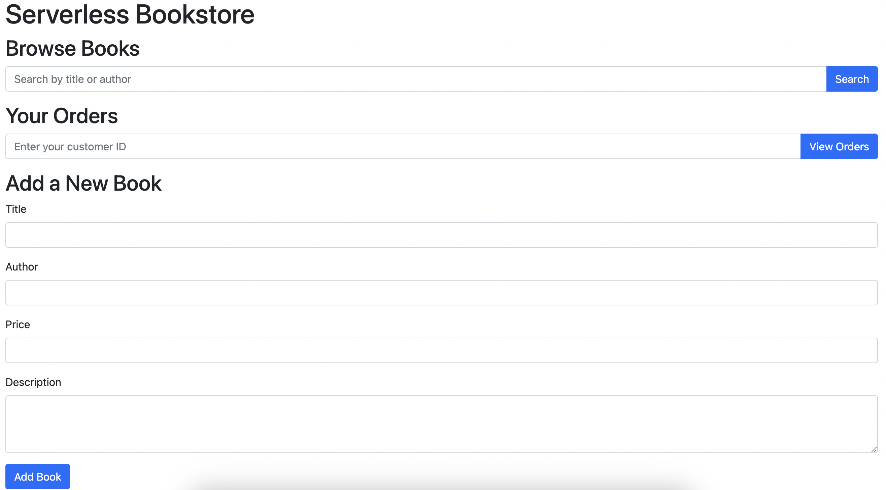

## Serverless Bookstore Project Documentation

### Overview

The **Serverless Bookstore** project is a web-based application that allows users to browse books, order books, view their orders, and add new books to the store. The application is built using AWS services, including DynamoDB for data storage, S3 for static website hosting, API Gateway for routing requests, and Lambda functions for backend processing. The front end is developed using HTML, JavaScript, and Bootstrap for a responsive and user-friendly interface.


Note: See `/images/README.md`for more photo examples
### Architecture

- **DynamoDB**: Stores book and order data. The primary table has `id` as the partition key. A Global Secondary Index (GSI) is used for querying orders by `customer_id`.

  
- **S3**: Hosts the static website, serving HTML, CSS, and JavaScript files.

- **API Gateway**: Acts as the interface between the front end and the backend Lambda functions. It handles HTTP requests and forwards them to the appropriate Lambda function.

- **Lambda**: Processes requests to interact with DynamoDB (e.g., searching for books, creating orders, adding books).

### Features

1. **Browse Books**
   - Users can search for books by title or author using the search bar using `title:TitleName` or `author:AuthorName`.
   - The results are displayed in responsive Bootstrap cards that include the book title, author, price, description, and a "Buy" button.
   - The `searchBooks` function handles this feature by making a GET request to the API Gateway, which in turn queries DynamoDB.

2. **Create Order**
   - Users can purchase a book by clicking the "Buy" button on a book card.
   - The `createOrder` function prompts the user for their customer ID and sends a POST request to create a new order in DynamoDB.

3. **View Orders**
   - Users can view their orders by entering their customer ID.
   - The `getOrders` function retrieves the order details from DynamoDB using the customer ID and displays them in a list format.
   - Each order card displays the order ID, status, and timestamp.

4. **Add a New Book**
   - Administrators or users with appropriate access can add new books to the store.
   - The `createBook` function allows users to submit a form with the book title, author, price, and description. This data is sent to the API Gateway, which triggers a Lambda function to insert the new book into DynamoDB.


### Implementation Details

#### 1. **DynamoDB Configuration**
   - **Books Table**: Stores information about each book.
     - Primary Key: `id` (String)
     - Attributes: `title`, `author`, `price`, `description`, `created_at`
   
   - **Orders Table**: Stores customer orders.
     - Primary Key: `id` (String)
     - Attributes: `book_id`, `customer_id`, `order_timestamp`, `status`
     - Global Secondary Index: `customer_id` (String)

#### 2. **API Gateway**
   - **Books Endpoint**:
     - `GET /books`: Retrieve books based on title or author.
     - `POST /books`: Add a new book.
   - **Orders Endpoint**:
     - `GET /orders/{customer_id}`: Retrieve orders for a specific customer.
     - `POST /orders`: Create a new order.

#### 3. **Lambda Functions**
   - **Search Books**: Queries the DynamoDB books table based on title or author.
   - **Create Book**: Inserts a new book into the DynamoDB books table.
   - **Get Orders**: Queries the DynamoDB orders table using the customer ID GSI.
   - **Create Order**: Inserts a new order into the DynamoDB orders table.

### Frontend Details

- **Bootstrap**: Used for styling and responsive design.
- **JavaScript**: Handles all interactions with the API Gateway, including fetching data, updating the DOM, and handling user inputs.
- **Responsive Design**: Ensures that the application is usable on various devices, with responsive columns and cards.

### Setup and Deployment
Most of the deployment is done using terraform with a few additional manual steps. To deploy the infrastructure go to the terraform folder and apply it

```bash
cd terraform
terraform init
terraform plan
terraform apply
```
**Note:** In case there are any errors reapply everything and the deployment should finish the second time. (The reason is a race condition which even with depends_on isnt solved)

Afterwards change `const apiGatewayUrl = '<<terraform.output.api_gateway_url>>'` in line 55 in `frontend/index.html` with the output of the terraform variable. Then login into the `AWS Console` and upload `frontend/index.html`to the S3 Bucket `serverless-bookstore-uuid`. The deployment is now complete.

The terraform scripts will do the following:
1. **DynamoDB**:
   - Create a `Books` and `Orders` tables in DynamoDB.
   - Set up a Global Secondary Index for `customer_id` on the `Orders` table.

2. **API Gateway**:
   - Create a RESTful APIs for handling book and order operations.
   - Integrate these APIs with the respective Lambda functions.

3. **Lambda Functions**:
   - Deploy Lambda functions to handle the logic for book searching, book creation, order retrieval, and order creation.

4. **S3 Hosting**:
   - Create a S3 Bucket where the HTML files will be uploaded.
   - Configure the S3 bucket for static website hosting.

5. **Permissions and IAM Roles**:
   - Ensure that the Lambda functions have the necessary IAM roles to interact with DynamoDB.
   - Set up CORS on API Gateway to allow requests from the S3-hosted frontend.

### Usage

1. **Accessing the Application**: Users can access the application via the URL provided by the S3 bucket's static website hosting.
2. **Browsing and Searching**: Users can search for books by title or author, and view the details of each book.
3. **Placing Orders**: After finding a book, users can place an order by clicking the "Buy" button.
4. **Admin Functions**: Administrators can add new books to the store via the "Add a New Book" form.

### Conclusion

The Serverless Bookstore project demonstrates how to build a scalable and cost-effective e-commerce platform using serverless architecture on AWS. By leveraging DynamoDB, API Gateway, and Lambda, the project minimizes the need for server management while ensuring high availability and scalability. The responsive front-end design ensures a seamless user experience across different devices.